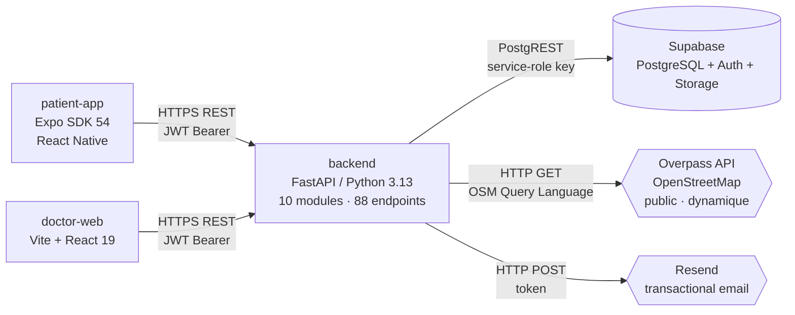

<p align="center">
  
</p>

<h1 align="center">Yalla</h1>

<p align="center">
  <strong>Plateforme bienveillante de suivi clinique et de soutien social</strong><br/>
  pour les personnes vivant avec l'obésité ou le diabète.
</p>

<p align="center">
  <em>Projet du cours de Master: From Concept to Market, UNIGE 2026.</em><br/>
  Médecin, patient et patient-expert collaborent sur un seul produit, avec un contrôle granulaire du partage de données.
</p>

---

## Sommaire

- [Le pitch en deux paragraphes](#le-pitch-en-deux-paragraphes)
- [Démo](#démo)
- [Ce que fait l'app](#ce-que-fait-lapp)
- [Architecture](#architecture)
- [Stack technique](#stack-technique)
- [Marche à suivre — lancer le projet en local](#marche-à-suivre--lancer-le-projet-en-local)
- [Tests](#tests)
- [Highlights ingénierie](#highlights-ingénierie)
- [Déploiement](#déploiement)
- [Roadmap](#roadmap)
- [L'équipe](#léquipe)

---

## Le pitch en deux paragraphes

Le diabète de type 2 et l'obésité sont des maladies chroniques où l'adhésion au plan de soins se joue **entre deux rendez-vous médicaux**, dans les choix quotidiens : marcher, cuisiner, sortir, demander de l'aide. Les outils existants traitent ces deux moments séparément — applications grand public côté patient, dossiers cliniques côté médecin — et n'offrent quasiment aucun pont entre les deux.

Yalla est une **plateforme intégrée** où le médecin invite ses patients depuis un dashboard web, où chaque patient suit ses propres défis et son activité depuis une app mobile, et où des **patients-experts** modèrent une communauté de soutien. Le patient garde la main sur **ce qu'il partage** (cinq curseurs granulaires, du « partage complet » au « mode données privées » qui ne laisse passer que l'essentiel clinique) — le médecin garde la lisibilité sur l'évolution médicale. Une boucle de défis personnalisés, de badges, de messagerie patient/expert et de recherche de restaurants sains (via OpenStreetMap) maintient l'engagement entre les consultations.

## Démo

> Toute la démo tourne sur un seul droplet DigitalOcean (1 vCPU / 1 Go) derrière Caddy, avec EAS Update pour la distribution mobile.

| Surface | Lien | Notes |
|---|---|---|
| Dashboard médecin | https://46-101-16-132.nip.io | Login : compte de démo fourni au pitch |
| API + Swagger | https://46-101-16-132.nip.io/docs | OpenAPI 3.1 auto-générée par FastAPI |
| App patient | Expo Go, channel `production` | QR code distribué le jour du pitch |
| Rapport applicatif | `report/README.md` | 8 sections, ~1300 lignes de documentation technique (gitignoré) |

## Ce que fait l'app

### Côté patient (Expo / React Native)

- **Login + activation par invitation** — pas de self-signup ; le médecin invite, le patient choisit son mot de passe via un token jetable.
- **Onboarding** — âge, objectif principal, préférences de partage à la première ouverture.
- **Home** — vue d'ensemble : défis du jour, podomètre (capteur natif iOS/Android), prochains rendez-vous.
- **Défis** — catalogue de challenges (marche, nutrition, hydration, sommeil), assignation idempotente, badges.
- **Communauté** — feed (posts texte ou photos), likes idempotents par PK composite, commentaires persistés, machine à états d'amitié, groupes thématiques (marche, cuisine, soutien), micro-défis de groupe.
- **Sessions** — séances de coaching ou de groupe organisées par les patients-experts.
- **Messagerie** — DM patient ↔ patient-expert avec compteur de non-lus, optimistic UI + rollback.
- **Restaurants** — recherche en temps réel via **Overpass / OpenStreetMap** avec scoring nutritionnel maison + fallback statique.
- **Accès / Confidentialité** — cinq curseurs `share_*` indépendants + mode global « Données privées ».

### Côté médecin (Vite / React)

- **Dashboard** — liste filtrée des patients, indicateurs d'engagement, statut clinique.
- **Création de compte patient** — formulaire qui génère le token d'invitation + email Resend.
- **Fiche patient** — évolution médicale (HbA1c, IMC, glycémie), défis actifs, notes médecin/patient — avec **masque de confidentialité service-side** (12 tests unitaires).
- **Bascule rôle patient-expert** — propagée à l'app patient via polling 60 s.
- **Notes cliniques** — édition / suppression CRUD complet.

## Architecture



**Choix structurants** :

- **Monolithe modulaire FastAPI** — 10 modules métier (`auth`, `users`, `doctors`, `patients`, `social`, `messaging`, `challenges`, `restaurants`, `health`, `consents`), chacun avec son `router.py` / `schemas.py` / `service.py`. Pas d'ORM : appels directs Supabase via `supabase-py`.
- **Identité unifiée** — une seule table `profiles` discriminée par `role` ; le lien `auth_user_id` vers Supabase Auth est nullable, ce qui permet au médecin de provisionner un patient avant l'activation du compte auth.
- **Confidentialité à deux étages** — `privacy_level` général + cinq flags granulaires (`share_activity`, `share_challenges`, `share_restaurants`, `share_posts`, `share_messages_with_expert`).
- **Compteurs dénormalisés** — `feed_posts.likes` / `comments_count` sont maintenus par la couche service après chaque mutation pour éviter les `COUNT(*)` au listing.

**Détail complet de l'architecture, du modèle de données et des algorithmes** : `report/01-architecture.md` à `report/08-annexes.md`.

## Stack technique

| Couche | Outils |
|---|---|
| Backend | Python 3.13, FastAPI, Pydantic v2, `supabase-py` 2.30, `httpx`, `uv` |
| App patient | Expo SDK 54, React 19, React Native, `expo-updates`, `expo-secure-store`, `lucide-react-native` |
| Dashboard médecin | Vite 7, React 19, `react-native-web` (composants partagés avec l'app), Vitest 4 |
| Base de données | PostgreSQL 15 via Supabase, RLS, 18 migrations versionnées |
| Auth | Supabase Auth (GoTrue) — email/password + JWT + refresh |
| Email | Resend (transactional, best-effort) |
| API externe | Overpass / OpenStreetMap |
| Proxy | Caddy (HTTPS auto via Let's Encrypt) |
| Déploiement | Docker Compose sur droplet DigitalOcean + EAS Update pour la distribution mobile |
| Tests | `pytest` + `pytest-cov`, `Vitest` + `@testing-library/react` |

## Marche à suivre — lancer le projet en local

### Pré-requis

- Python 3.13+ et [`uv`](https://docs.astral.sh/uv/getting-started/installation/)
- Node 20+
- Un projet Supabase (cloud gratuit ou self-hosté — cf. [Déploiement § auto-hébergé](#alternative--full-docker-supabase-auto-hébergé))

### 1. Backend

```bash
# Cloner le dépôt
git clone git@github.com:Lip1200/yalla.git
cd yalla

# Installer les dépendances
uv sync

# Configurer l'environnement
cp .env.example .env
# Remplir SUPABASE_URL, SUPABASE_KEY, API_SECRET_TOKEN, RESEND_API_KEY (optionnel)

# Appliquer les 18 migrations sur ta base Supabase
# → Copier chaque supabase/migrations/*.sql dans le SQL Editor

# Lancer le serveur
uv run uvicorn src.main:app --reload
# → http://localhost:8000/docs
```

### 2. Dashboard médecin

```bash
cd frontend/doctor-web
npm install

# Configurer l'URL de l'API
cp .env.example .env
# → VITE_API_BASE_URL=http://127.0.0.1:8000

npm run dev
# → http://localhost:5173
```

### 3. App patient

```bash
cd frontend/patient-app
npm install

# Pointer vers ton backend (LAN IP, accessible depuis le téléphone)
EXPO_PUBLIC_API_BASE_URL=http://192.168.1.18:8000 npx expo start

# Scanner le QR code avec Expo Go
```

## Tests

| Suite | Commande | Volume | Couverture |
|---|---|---|---|
| Backend (unit + intégration) | `uv run pytest` | **130 tests** (106 unit + 24 intégration) | **56 % du code backend** |
| Dashboard médecin | `cd frontend/doctor-web && npm test` | **18 tests** (utils + smoke App) | helpers purs |

```bash
# Couverture HTML détaillée
uv run pytest --cov=src --cov-report=html
# → htmlcov/index.html

# Watch mode côté médecin
cd frontend/doctor-web && npm run test:watch
```

L'architecture des tests est documentée en détail dans `report/07-testing.md`. À retenir : un `FakeSupabaseClient` en mémoire (`tests/_fakes.py`) reproduit assez du contrat `supabase-py` pour valider la logique métier sans dépendre du cloud Supabase. Le client patche `supabase_client` au niveau module via `monkeypatch`, ce qui permet les tests d'intégration via `FastAPI TestClient` sans réseau.

## Highlights ingénierie

Quelques épisodes représentatifs de ce qui a été appris/résolu pendant le projet, documentés en détail dans `report/08-annexes.md` :

- **Le bug `postgrest.headers` (5h30, 3 fixes successifs)** — la fonction `postgrest.auth(token)` de `supabase-py` 2.x ne mute pas le client singleton ; après chaque `auth.sign_up`/`sign_in_with_password`, le bearer reste celui du dernier utilisateur authentifié. Pire : il faut réécrire **deux** dictionnaires de headers (`session.headers` ET `postgrest.headers`), sinon le builder chain `.table().select().execute()` continue d'envoyer le JWT du patient en silence et la RLS bloque tout sans erreur. Diagnostiqué via un spy `httpx`, fixé dans `src/core/database.py:restore_service_bearer`, gardé par un test de régression explicite.
- **EAS Update + Expo Go** — le comportement par défaut (`checkAutomatically=ON_LOAD`) applique le nouveau bundle au **prochain** démarrage, ce qui rendait les correctifs d'UX invisibles aux primo-arrivants au premier lancement. Ajout d'un `checkForUpdateAsync + fetchUpdateAsync + reloadAsync` au boot dans `frontend/patient-app/App.js`.
- **Audit des boutons** — 56 actions UI inventoriées et classifiées (`docs/BUTTON_AUDIT.md`) en `WIRED` / `LOCAL` / `MOCK` ; tous les boutons MOCK identifiés à la pré-soutenance ont été câblés au backend (likes, commentaires, messages, micro-défis de groupe, deux flags de partage).
- **Onboarding piégé** — l'écran d'onboarding ne se déclenchait jamais pour les patients invités parce que le formulaire médecin pré-remplissait `primary_goal` avec une valeur par défaut. Fix : champ vide par défaut, déclenchement par condition `!main_goal.trim()`.

## Déploiement

### Production actuelle — droplet DigitalOcean

- 1 vCPU / 1 Go RAM, Ubuntu 24.04
- `docker compose` : Caddy + backend (FastAPI) + doctor-web (Nginx + build Vite statique)
- Supabase **cloud** pour la DB + Auth + Storage
- Caddy gère HTTPS automatiquement via Let's Encrypt (`46-101-16-132.nip.io`)
- Patient-app distribuée OTA via EAS Update channel `production`

Procédure complète dans `deploy/README.md` ; mise à jour type :

```bash
ssh root@<droplet>
cd /opt/yalla
git pull origin develop
docker compose up -d --build
```

### Alternative — full Docker, Supabase auto-hébergé

La branche `feat/self-hosted-supabase-dockerisation` ajoute `deploy/self-hosted/` qui scaffolde une **stack Supabase complète en containers** (Postgres + GoTrue + PostgREST + Storage + Kong + Studio). Aucun changement de code applicatif requis — seules les variables d'env `SUPABASE_URL` et `SUPABASE_KEY` changent. Voir `deploy/self-hosted/README.md` pour les détails (~700 Mo à 1 Go de RAM additionnels selon la présence du Studio).

## Roadmap

Sorties du scope du semestre, ouvertes pour une suite :

- [ ] Application des flags `share_*` granulaires au masque de confidentialité côté médecin (la donnée est persistée, le branchement reste à finaliser).
- [ ] Table `session_participants` pour savoir *qui* a rejoint quelle séance (actuellement seul un compteur dénormalisé existe).
- [ ] Tests E2E Playwright sur le dashboard médecin.
- [ ] Suite Jest sur l'app patient (refactor préalable de `App.js` en sous-composants testables).
- [ ] Pipeline CI/CD GitLab Runner ou GitHub Actions — actuellement tests lancés à la main avant chaque merge.
- [ ] Rate limiting applicatif (`slowapi`) et audit sécurité automatisé.
- [ ] Push notifications via Expo Notifications API pour les rappels de défis.

## L'équipe

Projet réalisé dans le cadre du cours **From Concept to Market** (Master UNIGE, semestre printemps 2026) par :

- **Filipe Ramos** — backend, infrastructure, app patient
- **Mehdi Chouaibi** — backend, dashboard médecin
- **Alexandre Vavasseur** — backend, intégrations
- **Khloud Emad Abdelsatar Mahmoud** — UX, contenu pédagogique
- **Maïssa Bouneb** — UX, recherche utilisateur
- **Nazim Belaloui** — backend, qualité

## Licence

Code source publié à des fins de portfolio. Pour toute réutilisation ou question, ouvrir une issue ou contacter via l'adresse mail liée au profil GitHub.
