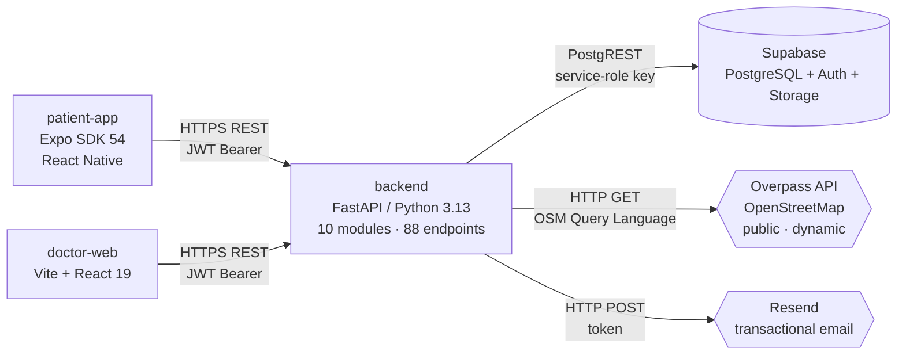

<p align="center">
  
</p>

<h1 align="center">Yalla</h1>

<p align="center">
  <strong>A compassionate clinical-monitoring &amp; social-support platform</strong><br/>
  for people living with obesity or diabetes.
</p>

<p align="center">
  <em>Master's course project — From Concept to Market, UNIGE 2026.</em><br/>
  Doctor, patient and expert patient collaborate on a single product, with fine-grained control over data sharing.
</p>

---

## Table of contents

- [Two-paragraph pitch](#two-paragraph-pitch)
- [Demo](#demo)
- [What the app does](#what-the-app-does)
- [Architecture](#architecture)
- [Tech stack](#tech-stack)
- [Getting started — run it locally](#getting-started--run-it-locally)
- [Tests](#tests)
- [Engineering highlights](#engineering-highlights)
- [Deployment](#deployment)
- [Roadmap](#roadmap)
- [The team](#the-team)

---

## Two-paragraph pitch

Type 2 diabetes and obesity are chronic conditions where adherence to a care plan happens **between two clinical visits**, in everyday choices: walking, cooking, going out, asking for help. Existing tools treat these two moments separately — consumer-grade apps on the patient side, clinical records on the doctor side — and offer almost no bridge between them.

Yalla is an **integrated platform** where the doctor invites their patients from a web dashboard, where each patient tracks their own challenges and activity from a mobile app, and where **expert patients** moderate a peer-support community. The patient stays in control of **what they share** — five granular toggles, from "share everything" to a "private data" mode that only forwards what is clinically essential. The doctor keeps a clean view of the medical evolution. A loop of personalised challenges, badges, patient/expert messaging and healthy-restaurant search (powered by OpenStreetMap) keeps engagement going between consultations.

## Demo

> The whole demo runs on a single DigitalOcean droplet (1 vCPU / 1 GB RAM) behind Caddy, with EAS Update handling mobile distribution.

| Surface | URL | Notes |
|---|---|---|
| Doctor dashboard | https://46-101-16-132.nip.io | Demo account provided at the pitch |
| API + Swagger | https://46-101-16-132.nip.io/docs | OpenAPI 3.1, auto-generated by FastAPI |
| Patient app | Expo Go, `production` channel | QR code distributed at the pitch |
| Full report | `report/README.md` | 8 sections, ~1300 lines of technical documentation (gitignored) |

## What the app does

### Patient side (Expo / React Native)

- **Login + activation by invitation** — no self-signup; the doctor invites, the patient picks a password through a one-shot token.
- **Onboarding** — age, primary goal, sharing preferences on first launch.
- **Home** — daily overview: today's challenges, step counter (native iOS/Android sensor), upcoming sessions.
- **Challenges** — challenge catalogue (walking, nutrition, hydration, sleep), idempotent assignment, badges.
- **Community** — feed (text or photo posts), idempotent likes via a composite-PK table, persisted comments, friendship state machine, themed groups (walking, cooking, support), group micro-challenges.
- **Sessions** — coaching or group sessions hosted by expert patients.
- **Messaging** — patient ↔ expert-patient DMs with unread counter, optimistic UI + rollback.
- **Restaurants** — real-time search through **Overpass / OpenStreetMap** with an in-house nutritional score + static fallback.
- **Access / Privacy** — five independent `share_*` toggles + a global "private data" mode.

### Doctor side (Vite / React)

- **Dashboard** — filtered patient list, engagement indicators, clinical status.
- **Create patient account** — form that generates the invitation token + Resend email.
- **Patient record** — medical evolution (HbA1c, BMI, glucose), active challenges, doctor / patient notes — with a **service-side privacy mask** (12 unit tests).
- **Toggle expert-patient role** — propagated to the patient app via 60 s polling.
- **Clinical notes** — full CRUD edit / delete.

## Architecture



**Load-bearing design decisions**:

- **FastAPI modular monolith** — 10 business modules (`auth`, `users`, `doctors`, `patients`, `social`, `messaging`, `challenges`, `restaurants`, `health`, `consents`), each with its own `router.py` / `schemas.py` / `service.py`. No ORM: direct Supabase calls via `supabase-py`.
- **Unified identity** — a single `profiles` table discriminated by `role`; the `auth_user_id` link to Supabase Auth is nullable, which lets the doctor provision a patient *before* the auth account exists.
- **Two-layer privacy** — global `privacy_level` plus five granular flags (`share_activity`, `share_challenges`, `share_restaurants`, `share_posts`, `share_messages_with_expert`).
- **Denormalised counters** — `feed_posts.likes` / `comments_count` are maintained by the service layer after each mutation to keep feed listings free of `COUNT(*)`.

**Full architecture, data model and algorithm details** live in `report/01-architecture.md` through `report/08-annexes.md`.

## Tech stack

| Layer | Tools |
|---|---|
| Backend | Python 3.13, FastAPI, Pydantic v2, `supabase-py` 2.30, `httpx`, `uv` |
| Patient app | Expo SDK 54, React 19, React Native, `expo-updates`, `expo-secure-store`, `lucide-react-native` |
| Doctor dashboard | Vite 7, React 19, `react-native-web` (components shared with the app), Vitest 4 |
| Database | PostgreSQL 15 via Supabase, RLS, 19 versioned migrations |
| Auth | Supabase Auth (GoTrue) — email/password + JWT + refresh |
| Email | Resend (transactional, best-effort) |
| External API | Overpass / OpenStreetMap |
| Proxy | Caddy (auto-HTTPS via Let's Encrypt) |
| Deployment | Docker Compose on a DigitalOcean droplet + EAS Update for mobile distribution |
| Tests | `pytest` + `pytest-cov`, `Vitest` + `@testing-library/react` |

## Getting started — run it locally

### Prerequisites

- Python 3.13+ and [`uv`](https://docs.astral.sh/uv/getting-started/installation/)
- Node 20+
- A Supabase project (cloud free tier — or self-hosted, see [Deployment § self-hosted alternative](#alternative--full-docker-self-hosted-supabase))

### 1. Backend

```bash
# Clone the repo
git clone git@github.com:Lip1200/yalla.git
cd yalla

# Install dependencies
uv sync

# Configure the environment
cp .env.example .env
# Fill in SUPABASE_URL, SUPABASE_KEY, API_SECRET_TOKEN, RESEND_API_KEY (optional)

# Apply the 19 migrations to your Supabase database
# → Copy each supabase/migrations/*.sql into the SQL Editor, in order

# Start the server
uv run uvicorn src.main:app --reload
# → http://localhost:8000/docs
```

### 2. Doctor dashboard

```bash
cd frontend/doctor-web
npm install

# Configure the API URL
cp .env.example .env
# → VITE_API_BASE_URL=http://127.0.0.1:8000

npm run dev
# → http://localhost:5173
```

### 3. Patient app

```bash
cd frontend/patient-app
npm install

# Point at your backend (LAN IP, reachable from the phone)
EXPO_PUBLIC_API_BASE_URL=http://192.168.1.18:8000 npx expo start

# Scan the QR code with Expo Go
```

## Tests

| Suite | Command | Volume | Coverage |
|---|---|---|---|
| Backend (unit + integration) | `uv run pytest` | **130 tests** (106 unit + 24 integration) | **56 % of backend code** |
| Doctor dashboard | `cd frontend/doctor-web && npm test` | **18 tests** (utils + App smoke) | pure helpers |

```bash
# Detailed HTML coverage
uv run pytest --cov=src --cov-report=html
# → htmlcov/index.html

# Watch mode for the dashboard
cd frontend/doctor-web && npm run test:watch
```

The test architecture is documented in detail in `report/07-testing.md`. Key point: an in-memory `FakeSupabaseClient` (`tests/_fakes.py`) reproduces enough of `supabase-py`'s contract to validate business logic without depending on the Supabase cloud. The fake patches `supabase_client` at module level via `monkeypatch`, which makes integration testing through `FastAPI TestClient` possible offline.

## Engineering highlights

A few episodes representative of what was learned / solved during the project, documented in detail in `report/08-annexes.md`:

- **The `postgrest.headers` bug (5.5 hours, 3 successive fixes)** — `supabase-py` 2.x's `postgrest.auth(token)` does **not** mutate the client singleton; after every `auth.sign_up` / `sign_in_with_password`, the bearer keeps the last authenticated user's JWT. Worse, you need to rewrite **two** header dictionaries (`session.headers` AND `postgrest.headers`) — otherwise the builder chain `.table().select().execute()` keeps silently sending the patient's JWT and RLS blocks everything with no error. Diagnosed with an `httpx` spy, fixed in `src/core/database.py:restore_service_bearer`, and locked in by an explicit regression test.
- **EAS Update + Expo Go** — the default behaviour (`checkAutomatically=ON_LOAD`) applies the new bundle on the **next** launch, which meant UX fixes were invisible to first-time users on first open. Added an explicit `checkForUpdateAsync + fetchUpdateAsync + reloadAsync` at boot inside `frontend/patient-app/App.js`.
- **Button audit** — 56 UI actions inventoried and classified (`docs/BUTTON_AUDIT.md`) as `WIRED` / `LOCAL` / `MOCK`; every MOCK button identified at the pre-pitch review has since been wired to the backend (likes, comments, messages, group micro-challenges, two share flags).
- **The onboarding trap** — the onboarding screen never fired for invited patients because the doctor's form pre-filled `primary_goal` with a default string. Fix: empty default + `!main_goal.trim()` trigger.
- **The un-versioned baseline tables** — the 18 numbered SQL migrations all *alter* `profiles` and `feed_posts`, but no migration ever *created* them. They had been authored manually in Supabase Studio and slipped past version control — uncovered the first time we replayed the migrations against a blank Postgres in the self-hosted stack. Backfilled by `supabase/migrations/000_baseline.sql`.

## Deployment

### Current production — DigitalOcean droplet

- 1 vCPU / 1 GB RAM, Ubuntu 24.04
- `docker compose`: Caddy + backend (FastAPI) + doctor-web (Nginx + static Vite build)
- Supabase **cloud** for DB + Auth + Storage
- Caddy handles HTTPS automatically via Let's Encrypt (`46-101-16-132.nip.io`)
- Patient app distributed OTA via the EAS Update `production` channel

Full procedure in `deploy/README.md`; typical update:

```bash
ssh root@<droplet>
cd /opt/yalla
git pull origin develop
docker compose up -d --build
```

### Alternative — full Docker, self-hosted Supabase

`deploy/self-hosted/` provides a tested-to-boot Docker Compose override that swaps the Supabase cloud dependency for a fully containerised stack (Postgres + GoTrue + PostgREST + Storage + Kong + Studio). **No application code change required** — only `SUPABASE_URL` and `SUPABASE_KEY` are updated. End-to-end smoke test (backend → Kong → PostgREST → Postgres) is documented in `deploy/self-hosted/README.md`. Expect ~700 MB–1 GB of additional RAM (Studio toggle).

## Roadmap

Out of semester scope, open for follow-up:

- [ ] Apply the granular `share_*` flags to the doctor-side privacy mask (the data is persisted; only the wiring step is left).
- [ ] A `session_participants` table to track *who* joined which session (today only a denormalised counter exists).
- [ ] Playwright E2E tests on the doctor dashboard.
- [ ] Jest suite on the patient app (requires a prior refactor of `App.js` into testable sub-components).
- [ ] CI/CD pipeline (GitLab Runner or GitHub Actions) — today tests run by hand before each merge.
- [ ] Application rate limiting (`slowapi`) and automated security audit.
- [ ] Push notifications via Expo Notifications API for challenge reminders.

## The team

Built as part of the **From Concept to Market** course (UNIGE Master's, spring semester 2026) by:

- **Filipe Ramos** — backend, infrastructure, patient app
- **Mehdi Chouaibi** — backend, doctor dashboard
- **Alexandre Vavasseur** — backend, integrations
- **Khloud Emad Abdelsatar Mahmoud** — UX, educational content
- **Maïssa Bouneb** — UX, user research
- **Nazim Belaloui** — backend, quality

## License

Source code published for portfolio purposes. For any reuse or question, open an issue or contact via the email tied to the GitHub profile.
